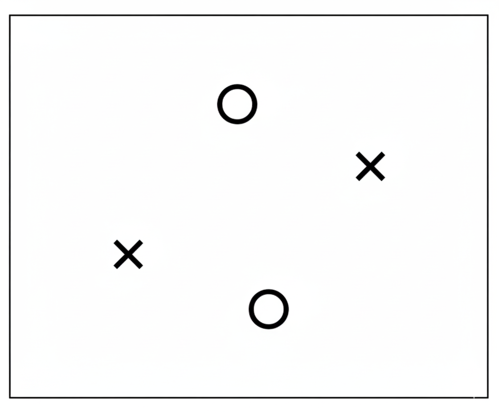

# Linear Classification

Linear classification은 $x_1, x_2, \cdots \in \mathcal{X}$ 에 대해 hypothesis $h \in \mathcal{H}$ 가 있어서 $h(x_i)$ 를 $\pm1$ 로 분류하는 작업을 의미한다. 

Linear classification의 feasibility를 따지자면, 앞에서 보았듯 (1) $E_{in} \approx E_{out}$ (2) $E_{in} \approx 0$ 임을 확인해야 한다. 하나씩 검증하자.

## Review

- $E_{in}(h) = \frac{1}{N} \sum^N_{n=1} \llbracket h(x_n) \neq f(x_n) \rrbracket$
- $E_{out}(h) = \mathbb{P}[h(x) \neq f(x)]$

$E_{in}$은 N개 뽑아서 오차 계산한 모평균, $E_{out}$은 실제 오차 확률

## Generalization error

tolerance level $\delta$를 정의하자. "이 정도 범위까지 bound는 용인하자"의 의미를 가지고 있다. 

$$
E_{out}(g) \leq E_{in}(g) + \sqrt{\frac{1}{2N} \ln \frac{2M}{\delta}}
$$

이 식의 루트와 ln은 사실 Hoeffding equation에서 온 거다.

$|E_{out} - E_{in}| \leq \epsilon$ 에서 $E_{out} \leq E_{in} + \epsilon$ 라 한다면 Hoeffding equation에 의해 $\delta = 2Me^{-2\epsilon^2N}$ 라 할 수 있다. 이를 반대로 $\epsilon$에 대해 풀면 위의 식이 나온다. 

tolerance level $\delta = 0.05$라 한다면 N개 뽑아서 측정한 오차와 실제 오차가 다를 확률의 범위가 5\%라는 말이다. 직관적으로 식을 이해하자면 실제 오차는 N개 측정한 오차 $+\epsilon$ 만큼 bound 되어있다.

## VC dimension

먼저 hypothesis set $\mathcal{H}$에 의해 생성된 **dichotomies(이분)** 를 정의하자. 

$$
\mathcal{H}(x_1, \cdots, x_N) = \{ \  ( \ h(x_1), \cdots, h(x_N) \ ) \ |  \ h \in \mathcal{H} \}
$$

각 원소는 $(+1, -1, -1, \cdots)$ 와 같은 $N$개의 튜플 형태일 것이다.

이를 이용해서 growth function을 정의하자.

$$
m _\mathcal H (N) = \max _ {x_1, \cdots, x_N \in \mathcal X} | \mathcal H (x_1, \cdots, x_N)|
$$

여기서 $| \ .\ |$ 는 cardinality (집합의 크기)를 의미한다.

해석하면 growth function은 주어진 $\mathcal X$의 크기 $N$에 대해 dichotomy의 최대 개수이다. 튜플 $(+1, -1, \cdots)$ 의 가짓수의 최댓값이다. 직관적으로 생각해도 각각 $\pm 1$ 이 모두 가능할 때가 최대이므로 다음과 같다.

$$
m _\mathcal H (N) \leq 2^N
$$

$2^N$보다 작아질 수 있는 이유는 이분 불가능한 경우가 생기기 때문이다. 

이러한 데이터셋의 경우는 직선 하나로 이분 불가능하다. 2차원 평면에서 이분하는 문제는 이러한 예시 때문에 $m _\mathcal H (4)$ 가 최대 16이 아닌 14가 된다.

이렇게 정의한 growth function을 이용해 hypothesis set $\mathcal H$ 의 **Vapnik-Chervonenkis dimension (VC dimension)** 를 다음과 같이 정의하자. 

$$
d_{VC} (\mathcal H) = \text{largest value of }N \ \textit{ s.t. } \ m _\mathcal H (N) = 2^N
$$

만약 모든 $N$에 대해 $\ m _ \mathcal H (N) = 2^N $ 라면 $d_{VC} = \infty$로 정의한다.

앞의 예시로 생각해보면, 2차원 평면에서 직선 하나로 이분하는 문제에서 $N=3$일 때는 항상 분류 가능하므로 $\ m _\mathcal H (3) = 2^3$ 가 성립했지만, $N=4$ 에서 불가능했다. 따라서 2차원 선형모델은 $d _{VC} = 3$ 이다.

다시 우리의 주제 linear classification으로 돌아와 생각해보자. 선형 모델의 경우 우리가 분류하고자 하는 데이터셋의 차원, 즉 feature space의 차원을 $d$라 하면 VC dimension은 다음과 같다.

$$
d_{VC} = d + 1
$$

"Linear classifier in $\mathbb R ^n$ 는 VC dimension = $n+1$ 까지 모든 경우에 대해 완벽하게 분류 가능하다" 라고 요약할 수 있다. 이유는 직관적으로 선형대수학의 선형독립과 자유도에 대한 내용을 생각해보면 된다. $n+2$에 대해서 완벽하게 분류 가능하다고 하면 모순이 생긴다. 수학적으로 엄밀하게 하면 어려우므로 패스하자. 2차원 평면의 선형 분류 모델은 확인했듯이 VC dimension이 $2+1 = 3$ 이다.

VC dimension의 의미는 $\mathcal H$의 복잡도를 나타낼 수 있다는 점에 있다. "분류 가능한 최대 점 개수"는 "얼마나 모델이 복잡한가"를 수학적 척도로 나타낸 것이다. 

다음과 같은 식도 성립하며 뒤에서 사용한다. 이는 수학적 귀납법으로 증명할 수 있다. 

$$
m_ \mathcal H (N) \leq N^ {d_{CV}} + 1
$$

## VC generalization bound

앞에서 본 generalization error에서 가설의 개수 $|\mathcal H| = M$을 $m_ \mathcal H(N)$으로 대체하면 다음과 같다. 

$$
E_{out}(g) \leq E_{in}(g) + \sqrt{\frac{1}{2N} \ln \frac{2 m_ \mathcal H(N)}{\delta}}
$$

$m_ \mathcal H (N) \leq N^ {d_{CV}} + 1$ 임을 이용하면 $d_{CV} = \infty$ 가 아닌 이상 N이 충분히 커진다면 $E_{out}$이 $E_{in}$에 충분히 가까워진다. $d_{CV} = \infty$ 인 케이스가 문제다. 따라서 이렇게 단순히 $M$을 $m _ \mathcal H (N)$로 대체하면 안 된다. 

따라서 다음과 같은 VC generalizaiton bound 식을 이용해야 한다. 

